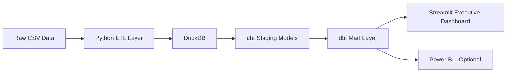
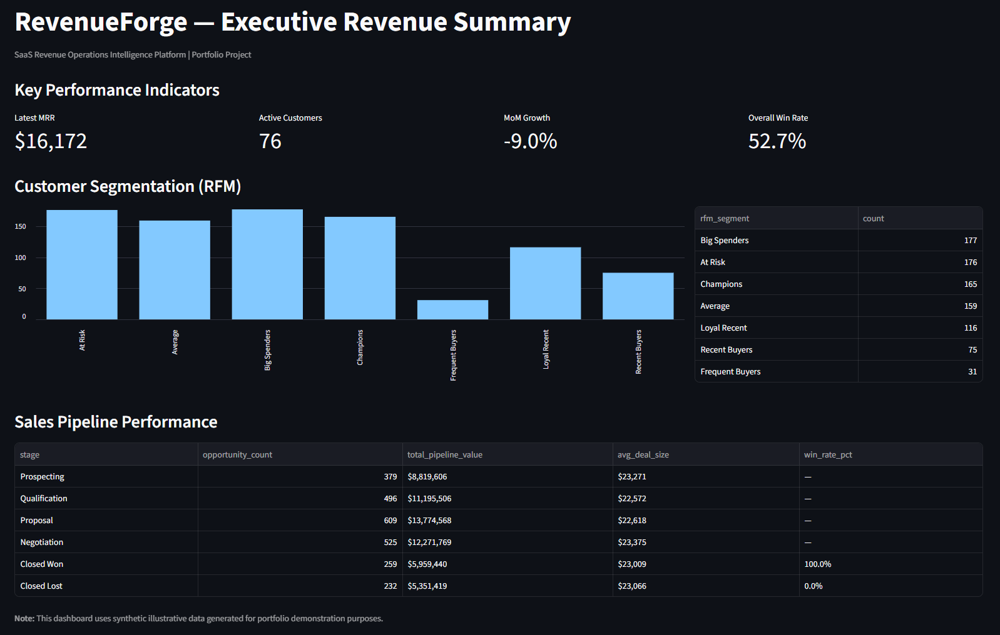

# RevenueForge — SaaS Revenue Operations Intelligence Platform

**End-to-end Business Intelligence solution** built with a modern data stack, advanced analytics, and executive-ready storytelling.

---

## Business Context

While generating **over $2 million in revenue** as a top-performing sales representative at Echo Logistics, I experienced firsthand the frustration of working with fragmented data, poor pipeline visibility, and limited ability to segment customers effectively in Salesforce.

RevenueForge was built to solve the exact problems I faced:
- Lack of clear revenue trends and growth signals
- Inability to identify high-value vs. at-risk customers
- Difficulty understanding true pipeline health and win rates

This project demonstrates how I would design and deliver analytics solutions that actually help sales and revenue teams make better decisions.

---

## Key Features

- **Modern Data Stack**: DuckDB + dbt for scalable, testable transformations
- **Advanced RFM Segmentation**: Business-meaningful customer segments (Champions, At Risk, Loyal Recent, etc.)
- **Accurate Pipeline Analytics**: Win rate correctly calculated only on closed opportunities
- **Executive Dashboard**: Clean, stakeholder-friendly Streamlit application
- **Production-Style Modeling**: Layered architecture (staging → marts) with clear documentation

---

## Tech Stack

| Layer              | Technology          | Purpose                              |
|--------------------|---------------------|--------------------------------------|
| Data Storage       | DuckDB              | Fast, local analytical database      |
| Transformation     | dbt                 | Modeling, testing, and documentation |
| ETL / Orchestration| Python + Pandas     | Data generation and loading          |
| Visualization      | Streamlit           | Interactive executive dashboard      |
| Optional           | Power BI            | Enterprise dashboard extension       |

---

## Project Structure

```
RevenueForge/
├── README.md
├── requirements.txt
├── data/
│   ├── raw/
│   └── processed/          # DuckDB database + CSVs
├── dbt/
│   ├── dbt_project.yml
│   ├── profiles.yml
│   └── models/
│       ├── staging/
│       ├── marts/
│       └── sources.yml
├── python/
│   └── etl/
├── streamlit/
│   └── app.py
└── docs/
```

---

## How to Run

### 1. Setup Environment

```bash
# Create and activate virtual environment
python -m venv venv

# Windows
.\venv\Scripts\Activate.ps1

# macOS / Linux
source venv/bin/activate

pip install -r requirements.txt
```

### 2. Generate Data & Load into DuckDB

```bash
python python/etl/generate_pipeline_data.py
python python/etl/prepare_and_load.py
```

### 3. Run dbt Transformations

```bash
cd dbt
dbt run
```

### 4. Launch the Dashboard

```bash
streamlit run streamlit/app.py
```

---

## Architecture



---

## Key Insights & Business Impact

This platform demonstrates capabilities that directly address real revenue operations challenges:

- **Customer Segmentation**: RFM analysis identifies high-value "Champions" and "At Risk" customers for targeted action
- **Pipeline Health**: Accurate win rate calculation provides trustworthy visibility into sales performance
- **Revenue Trends**: Monthly recurring revenue metrics and growth rates support forecasting and planning
- **Executive Communication**: Clean dashboard designed for non-technical stakeholders

This type of solution would have helped me make faster, more data-informed decisions when managing high-value accounts and pipelines.

---

## Skills Demonstrated

- End-to-end data pipeline development (ingestion → transformation → visualization)
- Advanced SQL and data modeling with dbt
- Business acumen and ability to translate metrics into actionable insights
- Clean, stakeholder-focused dashboard design
- Modern analytics tooling (DuckDB + dbt)

---

## Future Enhancements

- Add predictive churn scoring using machine learning
- Implement revenue forecasting models
- Connect live data sources instead of synthetic data
- Expand dashboard with self-service filtering and drill-down capabilities

---

## Screenshots

### Executive Revenue Summary



---

## Author

**Austin Paluch**  
Founder @ White Sky Tech Group  
[LinkedIn](https://www.linkedin.com/in/austin-p-2438132a6/) | [GitHub](https://github.com/austinpaluch)

---

*This project was built to showcase skills relevant to remote Business Intelligence Analyst and Revenue Operations roles.*